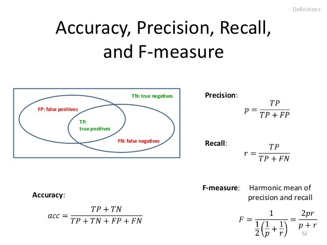

# **Perception Session**

In the previous session, we explored how autonomous systems work, their potential applications, the different autonomy levels, and the main components that make up an autonomous system. The first step in any autonomous system is gathering data from sensors and processing it to generate meaningful insights that guide the system’s subsequent operations. In this session, we will focus on  **Perception** .

## **About me**

👋 Hi! I'm **Kareem Elzahaby**

- Artificial Intelligence Level 300
- Former media member @ MMS
- Current Perception head @ AutonomousMMS
- Finalist in F1 tenth 2025

## **Agenda**

1. What is Perception?
2. Perception Goals
3. Perception challenges
4. Perception Sensors
5. Computer Vision
6. Machine Learning
7. Neural networks and Deep learning

## **What is Perception?**

The word itself means to be able to see, hear or become aware of something through your senses. It almost has the same meaning in autonomous systems or vehicles. In autonomous systems, Perception is the process by which an autonomous system interprets data from its sensors to understand and recognize its surrounding environment.

##### **Here are some examples of perception in an autonomous car:**

  

- Detect drivable space
- Detect the position of curbs
- know where are lanes and where to move

  

- Location of pedestrians
- Vehicles around such as cars and trucks
- Understanding traffic signs to know where we go and what we should do.

> This is essential for determining the vehicle’s behavior, planning its movements, and guiding its control decisions.

## **Perception Goals**

The primary goal of perception is to **understand the vehicle’s surroundings** by detecting, recognizing, and tracking relevant objects and environmental features. This understanding allows the autonomous system to  **plan safe paths, avoid collisions, and make intelligent driving decisions** .

We can divide perception goals into three main categories:

- ### **Static Objects**

  - #### **Off-road**

    - **Curbs** : The left and right edges of the road that define the drivable space for the vehicle.

      

        
      

    - **Traffic Lights** : Critical for determining the vehicle’s actions based on the active light signal.

      

        
      

    - Road signs are important to know the distance remained in your plan, increase or reduce speed, and if there are ring roads coming.

      

        
        
      

  - #### **On-road**

    - Road markings and lanes is crucial for keeping the vehicle correctly positioned, maintaining lane discipline, and planning safe navigation.

      

        
      

    - Construction signs, obstructions, and more are important to know information about the road.

      

        
        
      

- ### **Dynamic Objects**

  - Vehicles

    - 4 wheelers (cars, trucks)

      

        
      

    - 2 wheelers (motorbikes, bicycles)

      

        
      

  - Pedestrians

    

        
      

After what we have discussed about perception goals, I would like to talk about some challenges that faces perceptions and we will talk about some solutions to these challenges later.

---

## **Perception Challenges**

- **Robust detection and segmentation**
- **Sensor Noise and Uncertainty:** Sensors can introduce noise or inaccuracies due to weather conditions (rain, fog) or interference. This can result in poor detection accuracy.
- **Occlusion:** Objects may be partially or completely blocked by other objects, making it difficult for perception systems to detect and classify them. For example, a pedestrian behind a car may be hidden from a camera’s view.
  

    
  

- **Lighting Conditions:** Changes in lighting, such as shadows, glare, low-light environments, and reflections, can affect how objects are detected or segmented. Perception systems often struggle with consistency in varying lighting conditions.
  

    
  

- **Weather Conditions:** Weather phenomena like rain, snow, fog, and dust can obscure sensors (e.g., cameras, LiDAR), leading to degraded performance in object detection, classification, and tracking.
  

    
    
  

- **Real-Time Processing:** Balancing the need for speed with accuracy and robustness is a constant challenge, particularly when dealing with high-resolution data from multiple sensors.
- **Semantic Understanding:** Beyond detecting objects, perception systems must also understand the relationships between objects and the broader context of a scene (e.g., determining if a pedestrian is likely to cross the street based on their behavior).

> To overcome these challenges, researchers often work on developing more advanced algorithms, improving sensor technology, and using techniques like multi-sensor fusion (combining data from different sensors) and transfer learning (adapting models trained in one domain to perform well in another).

## **Perception Sensors**

After we have talked about the perception goals, now it is time to know about the sensors that are used to achieve these goals.
Like humans have senses to know their enviroment, autonomous cars must have sensors to use them for understanding the environment, planning the behavior to take on roads, and action control to meet its plans.

Sensors used in perception:

- Cameras
- LiDAR (Light Detection and Ranging)
- Radar (Radio Detection and Ranging)
- Ultrasonic Sensors

### **Cameras**

  

- Cameras are exceptionally cost-effective, and they can capture high-resolution images and videos, providing a detailed view of the environment.
- They assist in object detection, recognition, tracking, and scene understanding.
- Most vehicles have been equipped with mono-camera setups, meaning only 2D images of the environment could be generated.

### How camera capture images?

> Through the image sensor.

  

- Light from the environment reflects off objects and enters the camera through the lens. The lens focuses this light to form a clear image on the sensor inside the camera **`Image Sensor`**.
- Once the light passes through the lens, it strikes a sensor. Modern cameras use digital sensors, which **convert the light into electrical signals**. The sensor is made up of millions of light-sensitive elements called `pixels`
- The electrical signal represents the intensity and color of each pixel.
- To capture color, most cameras use a `Bayer filter`, which places red, green, and blue filters over the sensor’s pixels. These filters allow the sensor to capture color information for each pixel, which is then processed to produce a full-color image.
- After processing, the image is stored in the camera’s memory (SD card or internal storage) in a chosen format (e.g., JPEG or RAW).

---

**LiDAR**

  

After we discussed cameras, Let's talk about Lidar

> **LiDAR** also called **Li**ght **D**etection **A**nd **R**anging. It uses focused light or beam to detect range and create high resolution maps also called **Point Cloud** you can see its simulation in the gif below. Its use cases are 3D mapping, object detection, and obstacle avoidance.

  

- LiDAR Works by sending a beam to a remote object, the beam is reflected to the LIDAR sensor.
- Distance determined by beam travel time which is travelling at the speed of light.

  

$$
d = \frac{c*t}{2}
$$

$$
c = \text{speed of light = 3 x 10*8 m/s}
$$

---

###### **Radar Sensors**

Radar (Radio Detection and Ranging) sensors use radio waves to detect objects and measure their distance, speed, and direction. They work by emitting radio signals and analyzing the reflected waves when they bounce back from objects. Radar is widely used in vehicles for **adaptive cruise control, collision avoidance, and blind-spot detection** because it works well in poor visibility conditions such as  **fog, rain, or darkness** .

✅  **Advantages** :

* Works in all weather (fog, rain, dust, night).
* Long range (tens to hundreds of meters).
* Can measure **speed** of objects directly (via Doppler effect).

❌  **Disadvantages** :

* Lower resolution → can’t distinguish fine object shapes.
* Struggles to classify objects (e.g., car vs pedestrian).

###### **Ultrasonic Sensorss**

Ultrasonic sensors use **sound waves** at frequencies higher than human hearing to detect objects. They measure the time it takes for the sound pulse to travel to an object and reflect back (echo). These sensors are especially useful for  **short-range distance measurement** , such as in **parking assistance systems** where they detect nearby obstacles with high accuracy. However, they are more limited than radar in range and performance under noisy environments.

✅  **Advantages** :

* Very cheap and widely available.
* Great for **short-range detection** (few cm to a few meters).
* Simple and robust (no complex processing needed).

❌  **Disadvantages** :

* Limited range (only a few meters).
* Easily affected by noise or soft materials that absorb sound.
* Not useful at high speeds.

---

## **Computer Vision**

After we have known about the sensors needed for perception and working priciples of camera and lidar. Before we start talking about computer vision pipeline and the processes, we need to know first some information about digital images, grayscale, binary, and color images.

### **Digital Images**

  

- A numeric representation **matrix** of a two-dimensional image.
- They have a finite set of digital values called pixels.
- Contains a numbers of rows and columns of pixels.

> **Pixels** The smallest individual elements in an image, holding quantized values that represent the Brightness **Intensity** of a given color at any specific point.

---

### **Grayscale Images**

  

- Any shade of gray where:
  - The darkest shade of gray is black (value = 0).
  - The lightest shade of gray is white (value = 255).
- Contains brightness **(intensity)** value between the **minimum** value of the **data type** (0) and the **maximum** value of the **data type (255).**

---

### **Binary Images**

  

- They can have only two values:
  - Black (**0** or the **minimum** value of the **data type**).
  - White (**1** or the **maximum** value of the **data type**).
- Simple to process and analysis.
- Usually obtained from grayscale image $𝑔(𝑥,𝑦)$ by **thresholding**:

$$
f(x, y) =
\begin{cases}
0 &  g(x,y) \leq \text{Threshold} \\
1 & g(x,y) > \text{Threshold}
\end{cases}
$$

Example: Letters recognition

---

### **Color Images**

  

- Colored images in image processing are considered 3D matricies (for example: 1920 x 1080 RGB image is stored as a matrix of shape  1080 x 1920 x 3 each "slide" in the 3rd dimension corresponds to a color channel) :
  - Rows and columns that contains the intensity of a specific color or channel.
  - Channels which represent number of colors (RGB = 3 channels)
- Each pixel has three brightness values: **R**(ed), **G**(reen), and **B**(lue).
- **RGB** also represent the color space of the image.

---

### **Computer Vision Pipeline**

1. **Image Acquisition** → Capturing images or video from cameras.
2. **Preprocessing** → Enhancing images (denoising, resizing, color conversion).
3. **Feature Extraction** → Identifying important patterns like edges, corners, or textures.
4. **Object Detection/Recognition** → Detecting and classifying objects of interest.
5. **Post-Processing/Decision Making** → Passing results to the planning and control modules.

Now, we have the knowledge of digital images and its types, it is time to use the knowledge in the field of computer vision and see how this can benefit us in doing perception in our autonomous car.

### **Preprocessing**

- Image preprocessing is a crucial step in computer vision and image processing tasks
- We need to prepare the image taken from camera and extract the features, something interesting in image that can help us in our task, from it.
- Preprocessing help us in the field of image manipulation and enhancemnet.
- Here are some processes to increase the image quality.
  - #### **Histogram Equalization**

    

      
    

    As you see from the image the goal is to enhance the distribution of intensity of pixels.

    - We first measure the frequency of pixels in the image.
    - Then, we calculate the accumlative frequency and their overall sum.
    - Then, take the fraction of each accumlative frequency and their overall sum.
    - Then, multiply each fracion with the maximum value of pixels and round the results.

    This process distribute the intensity over the pixels and make image more readable and more informative.
  - #### **Noise Removal**

    

      
    

    > Scientists discovered some noise in images due to some factors in the camera and taking this noise and trying to build a function that represents it. With this noise function, they try to build an approach that denoises the image meaning that remove or reduce the noise.
    >

    In the image above, you can see some noise examples and some filters that try to reduce this noise efficiently.
    I will try to illustrate the median filter, and other filters you can search for it.

    

      
    

    - **Median Filters**

      - First, we take a square sample of the image of odd number such as $3x3$, $5x5$, etc.This sample called `kernel`
      - Then we take the `median` of all pixels values in this sanple. If the kernel is $3x3$ that means you have $9$ numbers.
      - Take this median and replace it in the center of the kernel in the original image.
      - Now, doing that again through the image, the result is that you modified $N-1$ $x$ $M-1$ as $N$ $x$ $M$ is the size of the original image.

      There are some variable that control this process called `stride` and `padding` you can search for it and I will try to illustrate them later in CNNs.
  - #### **Thresholding**

    

      
    

    - This process is critical for converting grayscale image to a binary image as we saw before.
    - It is essential part of image preprocessing for process, analysis, and feature extraction.

      Applications:
    - Document scanning and binarization (camscanner)
    - License plate detection

---

### **Feature Extraction**

- Process of extracting important information involves identifying and representing distinctive structures within an image.
- This done by first detect the feature and then make a desciption of the object that is in the image using these feature, so when you saw the same desciption in another image you can detect this object.
- Feature extraction divided into two processes called feature detection and feature description.

  - #### **Feature Detection**

    

      
    

    - When you're looking at an object it's necessary to break it down into its component features in order to make sense of what you're looking at this is known as feature detection.
    - There are many components that make up feature detection such as color, formation or shape, motion.
  - #### **Feature Description**

    - Defining a feature points by its coordinates in image frame
    - **Feature descripors** has a summary of each information about the feature.
    - These descripors have some characteristics

      1. **Repeatability:** The same feature should be detected even if the image changes slightly (e.g., translation, rotation, scaling, or lighting).

      

        
      

      2. **Distinctiveness:** The descriptor should make one feature different enough from another so the computer can tell them apart.

      

        
      

- Now after we have known processes used in feature extraction, I would like to mention its techniques in this image below.

    
  

- Let's talk about `Edge Detection` and build a foundation of how it works.

  - #### **Edge Detection**

    

      
    

    - Fundamental image processing technique for identifying and locating the boundaries or edges of objects in an image.
    - It depends on the rate change in intensity values.

    

      
    

    - **First derivative of edge model** is useful because edges are locations in the image where the intensity changes rapidly.
    - **Second derivative** is useful because zero-crossings often correspond to edges.

  

    
    
  

  - In images above, there are two edge techniques canny and sobel edge detection.

---

### **Machine Learning Algorithm**

> We modified images taken from camera and applied some preprocessing techniques, extract features, and now it is time to take the features as an input to a machine learning algorithm to do the multi-class classification task and object detection.

  
	

- #### **ML Terminology**

  - **Input:** It contains features $X$.
  - **Output:** Number indicated the label (class or category)
    In supervised machine learning, it takes features $X$ and labels $y$ and learn the pattern that map input and output. After learning the pattern, you can test the algorithm on a new input .

  

    
  

  - **Cost Function:** Function used to calculate the losses in the model and for model optimization.
  - **Gradient Decent:** Optimization Technique used for training model by updating parameters.

  

    
    
  

  - **Parameters:** They are learned or estimated purely from the data during training as the algorithm used tries to learn the mapping between the input features and the labels or targets.
  - **Hyperparameters:** They are parameters whose values control the learning process and determine the values of model parameters that a learning algorithm ends up learning.
  - **Hyperparameter Tuning:** Technique used to select the best hyperparameters and control complexity of the model.
  - **Model Training:** Process made to get the best parameters that map features with labels.

  

    
  

  - **Evaluation Metrics:** Specific criteria used to measure the performance of the model.

    

      
    

    - In the image below, Different metrics are used to measure the performance of the classification algorithm, these method are:
    - **Accuracy:** is the ratio of correctly predicted instances (both true positives and true negatives) to the total number of instances. It gives a general measure of how often the classifier is correct.
    - **Precision:** measures the proportion of positive predictions that are actually correct. It focuses on the accuracy of the positive predictions made by the model.
    - **Recall:** measures the proportion of actual positive instances that were correctly predicted by the model. It emphasizes how well the model identifies all positive cases.
    - **F1 Score:** is the harmonic mean of precision and recall. It provides a single metric that balances both precision and recall, especially useful when you need to find a balance between false positives and false negatives.

> This is a general terminology to start learn machine learning, explore its algorithms, how to control the model performance and specify hyperparameters.

---

### **Traditional Machine Learning VS Deep Learning**

  

> The pipeline we move through is a traditional machine learning workflow which contains feature extraction techniques, giving features as an input to a traditional ml algorithm like logistic regression, support vector machine, random forest, etc.

> All processes done in traditional machine learning workflow could be done using deep learning workflow within the algorithm itself.

---

### **Feature Extraction with Deep Learning**

  

- In the image above you can see how deep neural networks used to extract features, detect them, combine them, and finally doing the classification.
- First layer extract and detect edges, then second one combine these edges forming shapes, third layer combine these shapes forming the object, then classify this object for example car, truck, cone, etc.

---

#### **Neural Networks**

- A neural network is a series of algorithms that try to recognize relationships in a set of data by mimicking the way the human brain operates.
- Neural networks consist of layers of connected nodes (neurons), where each layer transforms the input data in some way.
- Neural networks are used in tasks like image classification, speech recognition, and language translation.

This is some knowledge about `Neural Networks` to be ready for `Convolutional Neural Networks`

---

### **Fully Connected Layers VS Convolutional Layers**

  
  

- In fully connected layers, each neuron in the $n$ layer become an input to `each` neuron in the $n+1$ layer.
- In convolutional layers, each neuron in the $n$ layer become an input to `subset` of neurons in the $n+1$ layer.

---

### **Deep Learning Models**

  

> In the image above, there are many deep learning algorithms used in computer vision field.
> I will illustrate just two of them, `Convolutional Neural Networks (CNNs)` and `YOLO (You Only Look Once)`.
> CNNs is the foundation of many models and YOLO is the model that is most used in the field of self driving cars or autonomous cars.

---

### **Convolutional Neural Networks**

  

- CNNs are a specialized kind of neural network designed for processing visual data (like images and videos).
- The main difference between CNNs and traditional neural networks is that CNNs automatically and efficiently capture spatial patterns in images, like edges, textures, and shapes.

#### **How Does a CNN Work?**

  

- CNNs consist of three main types of layers:
  - **Convolutional Layers:**
    - The core building block of a CNN.
    - In these layers, filters (small grids) slide over the input image (or the output of a previous layer) and apply convolutions to extract important features like edges, textures, or colors.
    - Each filter focuses on a different feature, like detecting horizontal edges or circular shapes.
  - **Pooling Layers:**
    - These layers reduce the size of the image data by summarizing information from small regions (e.g., taking the maximum or average value).
    - Pooling helps reduce the number of parameters and computations, making the model faster and preventing overfitting.
  - **Fully Connected Layers:**
    - Once the image is reduced to important features by the convolutional and pooling layers, these layers flatten the data into a vector and use it to make predictions.
    - Fully connected layers work like a traditional neural network.

#### **Key Concepts in CNNs:**

- **Filters/Kernels:**

  - Small grids (like 3x3 or 5x5) that slide over the image to detect patterns.
- **Stride:**

  - The step size of the filter as it moves across the image. A stride of 1 means the filter moves one pixel at a time.
- **Padding:**

  - Sometimes, extra pixels are added around the borders of the image to ensure the filter can scan the edges properly. This is called padding.

#### **Advantages of CNNs**

  

- Convolutional neural networks are by design, a natural choice to process images.
- CNNs automatically detect important features (like shapes, textures) without requiring manual feature extraction.
- Images are typically large, but CNNs reduce this data efficiently through convolution and pooling.
- Convolutional layers have less parameters than fully connected layers, reducing the chances of overfitting.

---

### **YOLO**

- YOLO (You Only Look Once) is a real-time object detection algorithm.
- It is a single-stage object detector that uses a convolutional neural network (CNN).
- YOLO is widely used in real-world projects because of its accuracy and speed.
- YOLOv12 is the latest advancement in the YOLO (You Only Look Once) family of object detection models.

## Recap

- Through this session we covered:
  - What perception is and knowing why we need it in autonomous system.
  - Determine perception goals and divided them into static and dynamic objects and localization of your car. This knowledge make us understand which techniques we should use.
  - We also knew the challenge that faces perception and the solutions were discussed later in computer vision branch.
  - We mentioned sensors needed for perception and talking about two sensors in more detailed.
  - Finally, We talk about digital images and how computer saw them, also knew image preprocessing techniques and why it is important to enhance images, also determine feature extraction techniques especially edge detection technique, then build some knowledge of machine learning and deep learning and talk about CNNs in detail.

## Resources

- ### **Free**

  - #### [Computer Vision `Arabic` - YouTube](https://www.youtube.com/watch?v=vzz5TR0bas8&list=PLyhJeMedQd9QrXtCspclJ9ace2urp05o0)
  - #### [Machine Learning `English` - YouTube](https://www.youtube.com/watch?v=Gv9_4yMHFhI&list=PLblh5JKOoLUICTaGLRoHQDuF_7q2GfuJF)
  - #### [Deep Learning for Computer Vision `English` - YouTube](https://www.youtube.com/watch?v=dJYGatp4SvA&list=PL5-TkQAfAZFbzxjBHtzdVCWE0Zbhomg7r)
  - #### [Self-Driving Cars — Andreas Geiger `English` - YouTube](https://www.youtube.com/watch?v=_q4WUxgwDeg&list=PL05umP7R6ij321zzKXK6XCQXAaaYjQbzr)
- ### **Paid** `English`

  - #### [Machine Learning Specialization - Coursera](https://www.coursera.org/specializations/machine-learning-introduction?)
  - #### [Deep Learning Specialization - Coursera](https://www.coursera.org/specializations/deep-learning?)
  - #### [First Principles of Computer Vision Specialization - Coursera](https://www.coursera.org/specializations/firstprinciplesofcomputervision)
  - #### [Self-Driving Cars Specialization - Coursera](https://www.coursera.org/specializations/self-driving-cars)
  - #### [Self Driving Car Engineer - Udacity](https://www.udacity.com/course/self-driving-car-engineer-nanodegree--nd0013)

---

### **Have Questions? Reach Out!** ✉️

If you have any questions or need further clarification about anything in this documentation, feel free to get in touch. We're here to help you on your journey into the world of autonomous systems!

You can contact us at:

📧  **Email** : mmsautonomousteam@gmail.com

We're excited to support you and look forward to your questions! 😊
