## About the instructor

👋 Hi! I'm **Ahmed Mwafy**

* 🎓Mechatronics Level 300
* ✨Autonomous Member 24-Now
* 🧠 Motion Planning

---

## Session Agenda:

* **Defining a planning problem**
* **What is an optimal path ?**
* **How do we get a map ?**
* **Graph Search Algorithms (PP)**
* **Obstacle Avoidance strategy (MP)**

---

# Define a Planning Problem .

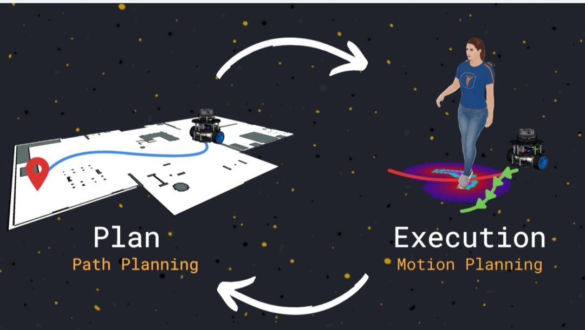

### What is Path Planning ?

**Path Planning** is the process of finding a **feasible route** from a starting point to a destination while avoiding obstacles. It focuses on  **where to go** .

### Key Points:

* It works in **abstract spaces** like grids or graphs.
* The result is usually a sequence of  **positions or waypoints** .
* It doesn’t worry yet about how the robot physically moves through those points — only that the path is clear and valid.

### Example Applications:

* Finding a route on Google Maps
* Navigating a warehouse robot to a target shelf
* Planning a drone’s high-level flight path

### What is Motion Planning ?

**Motion Planning** takes it a step further — it figures out **how to physically move** along the path, taking into account the robot’s size, speed limits, dynamics, and kinematic constraints.

### Key Points:

* It works in the **real physical world** or  **configuration space (C-space)** .
* Considers robot  **shape** ,  **velocity** ,  **acceleration** , and  **safety** .
* Ensures smooth, executable, and  **collision-free movement** .
* Handles changes over time: e.g., moving obstacles or real-time corrections.

### Example Applications:

* A robot arm reaching for a tool without hitting anything
* A car following a curved road while obeying turning limits
* A humanoid robot walking across uneven ground

## 🧠 Path Planning vs Motion Planning

| Feature        | Path Planning                     | Motion Planning                               |
| -------------- | --------------------------------- | --------------------------------------------- |
| Focus          | **Where to go**             | **How to go**                           |
| Concerned with | Obstacles & route                 | Dynamics, timing, smoothness                  |
| Output         | Waypoints or route                | Executable trajectory                         |
| Level          | High-level                        | Low-level / physical execution                |
| Example        | “Go from A to B avoiding walls” | “Turn smoothly, accelerate, stop if needed” |

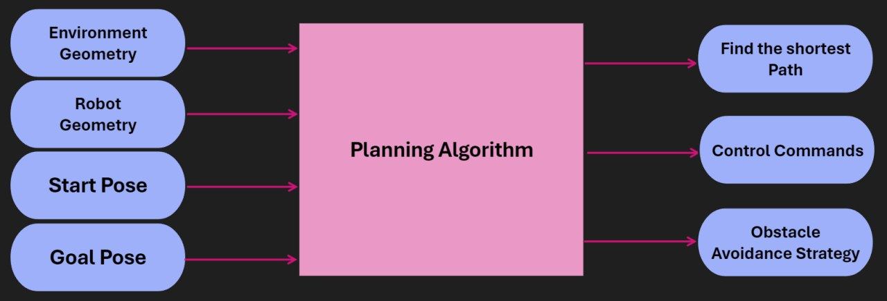

---

## Physical Space (Environment)

    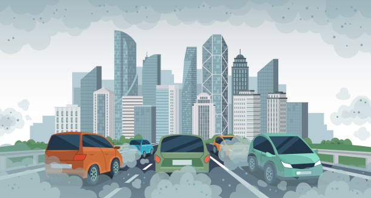

### 🔹 Definition

In path planning, the **environment** refers to the **real physical space** where an autonomous agent—such as a robot or vehicle—navigates. It is the actual world surrounding the agent that must be understood and considered to generate safe and effective paths.

### 🔹 Physical Components

The environment includes:

* **Static objects** : buildings, walls, furniture, roads, etc.
* **Dynamic elements** : people, vehicles, animals, or other moving obstacles
* **Terrain and surface types** : flat ground, slopes, rough terrain, water, etc.
* **Boundaries and limits** : areas the agent is not allowed or able to enter

### 🔹 Summary

The environment in path planning is not a virtual or abstract concept—it's the **real-world physical space** the agent moves through. Understanding and modeling this environment accurately is essential for generating safe, feasible, and goal-directed paths.

---

## Configuration Space (C-space) in Path Planning

    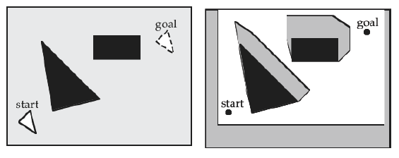

### 🔹 What is C-space?

The **Configuration Space (C-space)** is an **abstract representation** of all possible positions and orientations (i.e.,  **configurations** ) a robot or agent can have in a given environment.

* Each point in C-space represents a **unique state** (e.g., position and orientation) of the robot.
* It transforms the problem of navigating in a **real physical environment** into a **mathematical space** where planning is easier to compute.

### 🔹 From Physical Space to C-space

While the **environment** is the  **real-world physical space** , the **C-space is a simplified, abstract model** of that space, tailored to the robot's geometry and constraints.

For example:

* In a 2D space, if a circular robot can move freely in an area, its configuration can be represented by (x, y).
* If the robot can also rotate, its configuration becomes (x, y, θ).
* Obstacles in the physical environment become **forbidden regions** in C-space, called  **C-obstacles** .

### 🔹 Components of C-space

1. **Free space (C-free)** :

   All configurations where the robot can exist without colliding with obstacles.
2. **Obstacle space (C-obstacles)** :

   All configurations where the robot would intersect with an obstacle in the environment.

### 🔹 Why Use C-space?

C-space allows planners to:

* Handle **robot geometry and orientation** more precisely.
* Transform complex motion planning problems into  **geometric or graph-based problems** .
* Simplify computation by focusing on configurations rather than full physical simulations.

---

## Discretization in Path Planning

    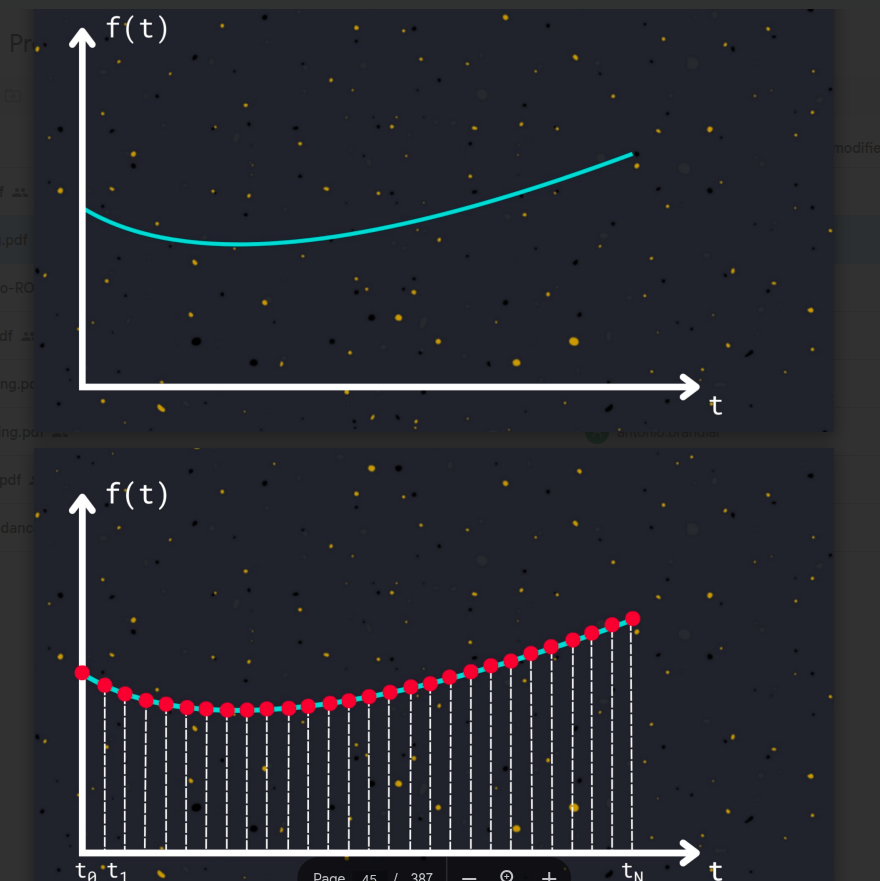

### What is Discretization?

**Discretization** is the process of converting a  **continuous space** —like the physical environment or configuration space (C-space)—into a **finite set of discrete elements** that can be processed by algorithms.

* It simplifies complex, infinite possibilities into manageable units.
* Commonly used in grid-based path planning or graph-based search algorithms (e.g., A*, Dijkstra).

### Why Discretize?

Most real-world environments and robot motions are  **continuous** , meaning the robot can be in infinitely many positions and orientations. However:

* Computers cannot process infinite states.
* Discretization makes the problem  **computationally tractable** .

### Where is Discretization Applied?

1. **Physical Environment**
   * Represented as a **grid map** or  **occupancy grid** .
   * Each cell represents a small region of space (e.g., 10 cm × 10 cm).
   * Used to check whether a space is **free** or  **occupied** .
2. **Configuration Space (C-space)**
   * The robot’s possible configurations (e.g., position and angle) are broken into  **discrete steps** .
   * Example: discretizing orientation into 16 fixed angles instead of using all 360°.
3. **Time and Motion**
   * In motion planning, time or movement commands may also be discretized (e.g., move forward in 0.1 m steps).

---

## What is Graph Construction in Path Planning?

In path planning, **graph construction** involves creating a **network of nodes and edges** that represents the **navigable space** of the environment or configuration space (C-space). The resulting graph can be searched using algorithms like A*, Dijkstra, etc., to find the shortest or safest path from start to goal.

There are multiple ways to construct such graphs, one of which is the  **visibility graph** .

---

## 🔹Visibility Graph

A **visibility graph** is a type of graph where:

* **Nodes** represent the  **start point** ,  **goal point** , and  **vertices of obstacles** .
* **Edges** represent direct, unobstructed lines (straight paths) between nodes that are **“visible”** to each other — i.e., no obstacle blocks the line connecting them.

It’s used primarily in **polygonal environments** where obstacles have well-defined shapes (like walls or convex polygons).

## 🔹 How It Works

1. **Input** : A 2D environment with polygonal obstacles, a start point, and a goal point.
2. **Vertices** : Add the  **start** ,  **goal** , and all **polygon corners** as graph nodes.
3. **Edges** : Connect pairs of vertices if the  **straight line between them doesn’t intersect any obstacle** .
4. **Weights** : Edge weights are typically the **Euclidean distance** between connected nodes.

   

   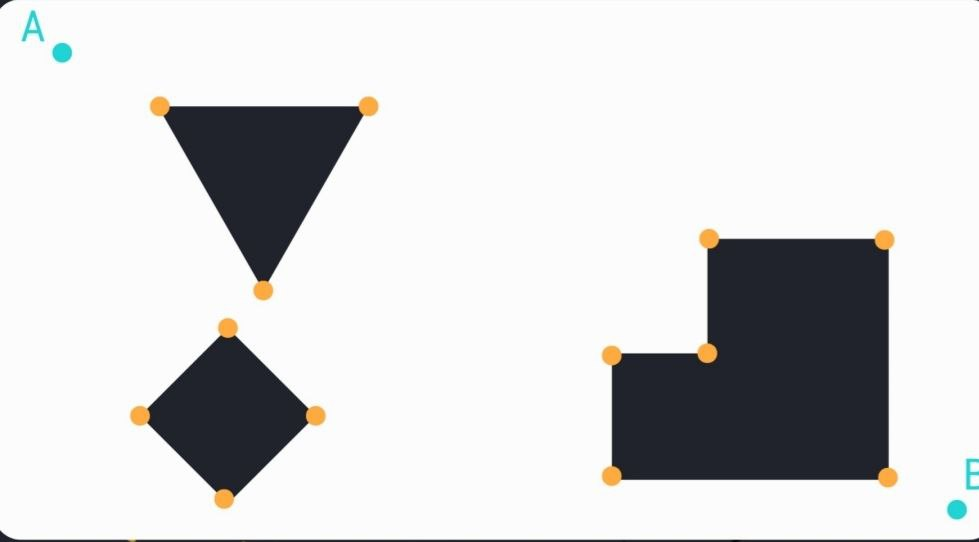

   

   

---

## 🔹Voronoi Diagram

A **Voronoi diagram** is a spatial data structure that divides a space into regions based on proximity to a set of **seed points** (also called  **sites** ). Each region contains all the points closer to one seed than to any other.

But there's more — this isn't just abstract math. It’s a *natural* way to model territory, influence, and safe navigation.

Imagine you're in a city with multiple hospitals. The **Voronoi region** for each hospital is the area where that hospital is the  **closest one** . In an emergency, you'd want to go to the hospital whose region you're in.

Now translate that to **obstacles** instead of hospitals, and you're a robot trying to stay far away from them — the **Voronoi edges** mark the safest, maximally-clear paths between obstacles.

### 🔹 Voronoi in Robotics & Path Planning

1. **Maximal Clearance**

   Robot paths that follow Voronoi edges are  *as far from obstacles as possible* . This is ideal for:

* Large robots
* Noisy sensors (like LiDAR)
* Dynamic or unknown environments

2. **Topological Roadmap**

   The Voronoi skeleton gives a **map of safe pathways** through the environment. You can use it to:

   * Build navigation graphs
   * Plan safe and robust paths
   * Handle dynamic replanning

     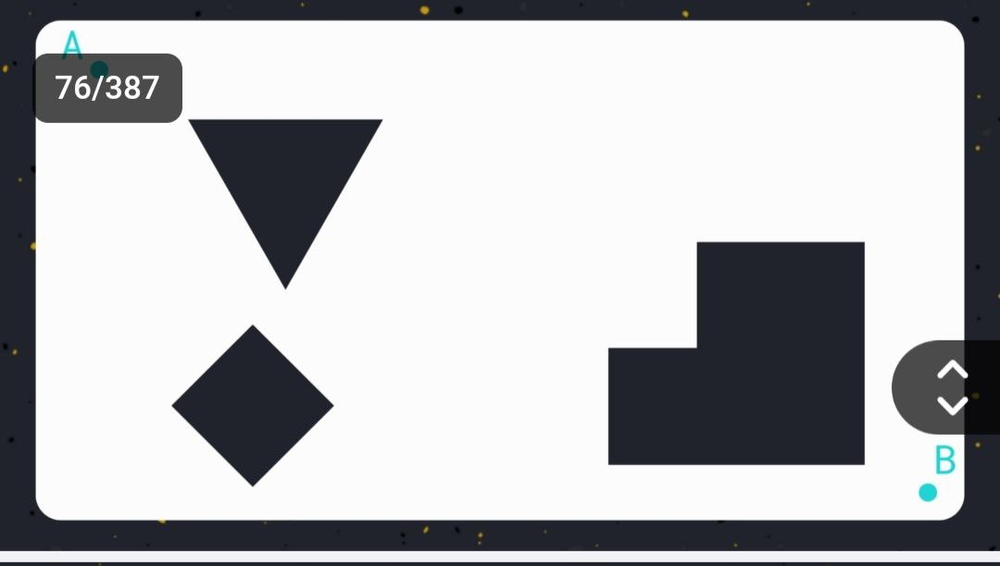

     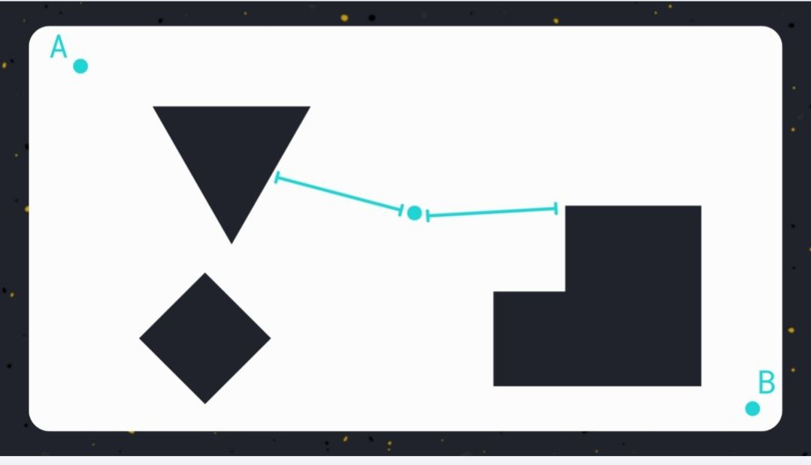

     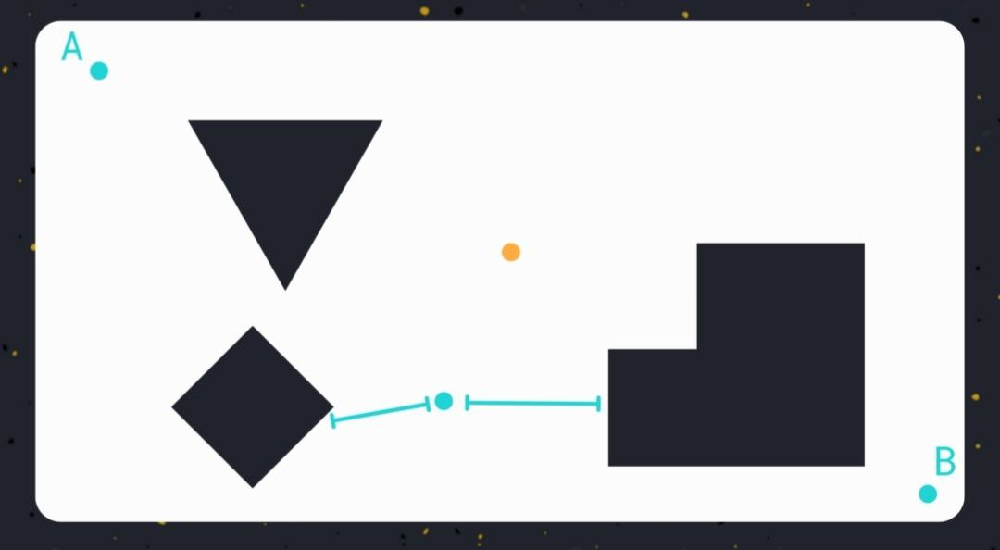

     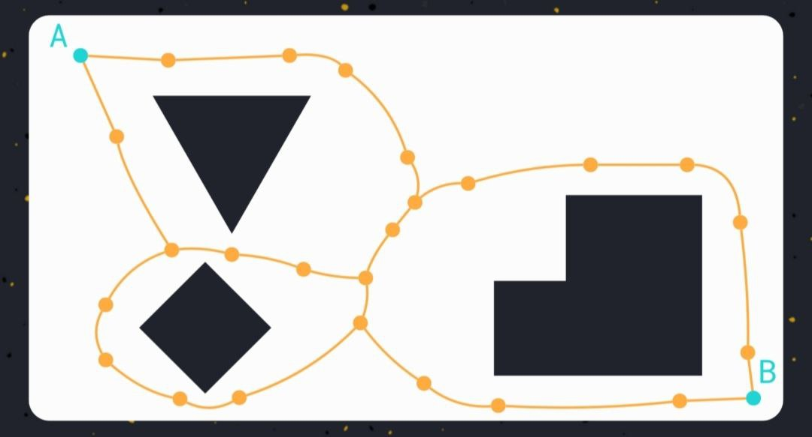

     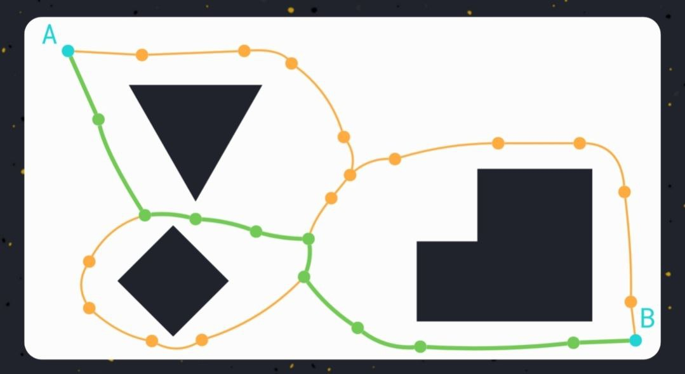

---

## 🔹Cell Decomposition

**Cell decomposition** is a technique where the **free space** (space not occupied by obstacles) is divided into **non-overlapping regions** (called  **cells** ) that are:

* **Simple to navigate**
* **Connected in a structured way**

Once the space is decomposed, path planning reduces to:

1. Find which cells the **start** and **goal** lie in.
2. Connect the cells via adjacency (usually through shared edges).
3. Plan a  **sequence of cells** , then a **local path** within each.

### 🔹 Types of Cell Decomposition

##### 1. **Exact Cell Decomposition**

* The cells **perfectly cover** the free space.
* Boundaries of obstacles are **exactly** respected.
* Example methods:
  * **Vertical Decomposition**
  * **Trapezoidal Decomposition**

✅  **Pros** :

* Guaranteed to find a path if one exists.
* Minimal number of cells.

❌  **Cons** :

* Computationally expensive.
* Requires exact obstacle geometry.

##### 2. **Approximate Cell Decomposition**

* Space is divided into **regular shapes** (usually grids or voxels).
* Each cell is either:
  * **Free**
  * **Occupied**
  * **Unknown**
* Commonly used in **occupancy grid maps** (e.g., SLAM).

✅  **Pros** :

* Easy to implement.
* Works with noisy sensor data (e.g., LiDAR).
* Good for real-time systems.

❌  **Cons** :

* May miss narrow passages (if resolution is low).
* More conservative.

  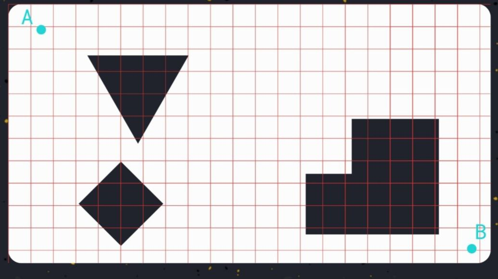

  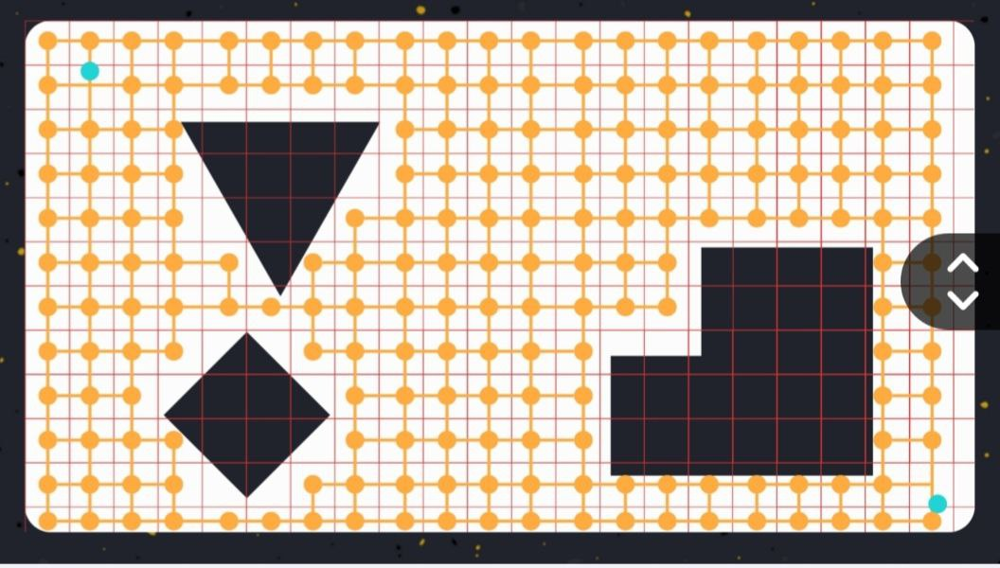

  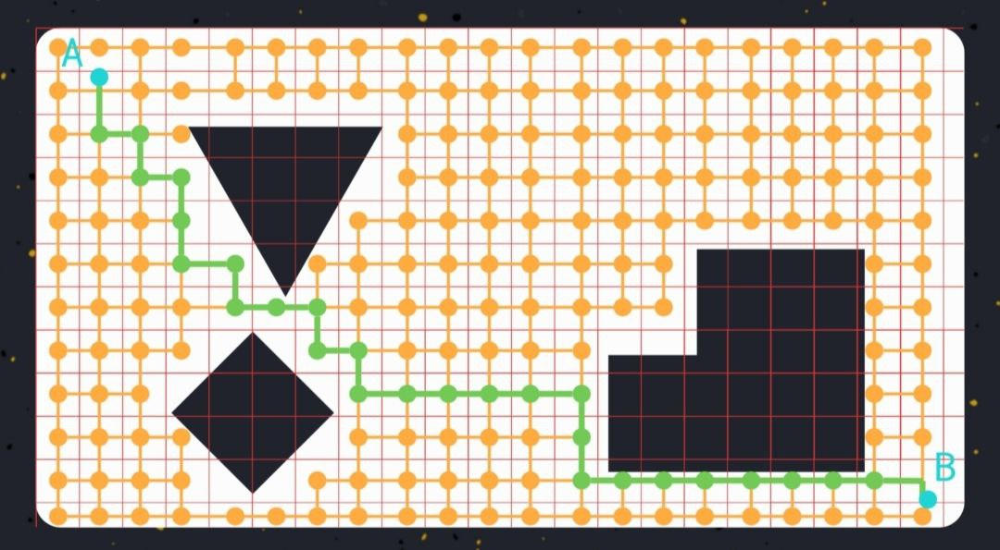

---

## A Journey from Real World To Map

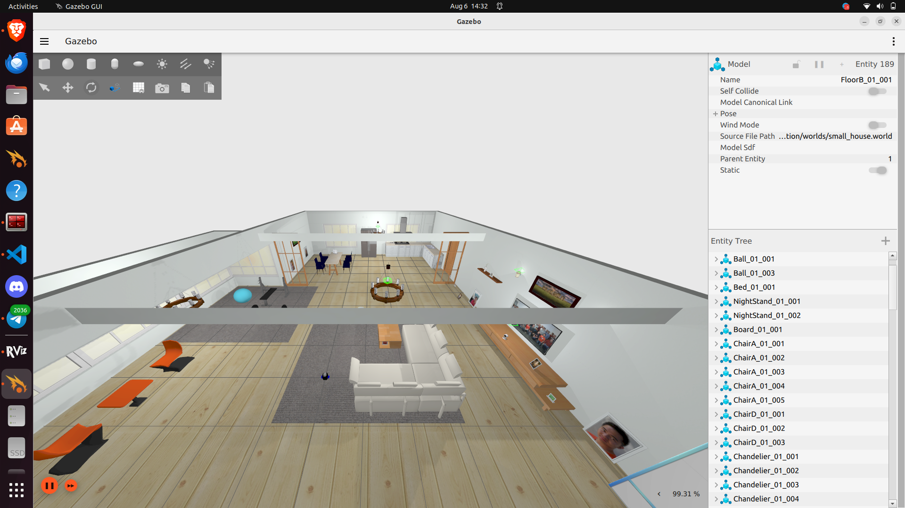

    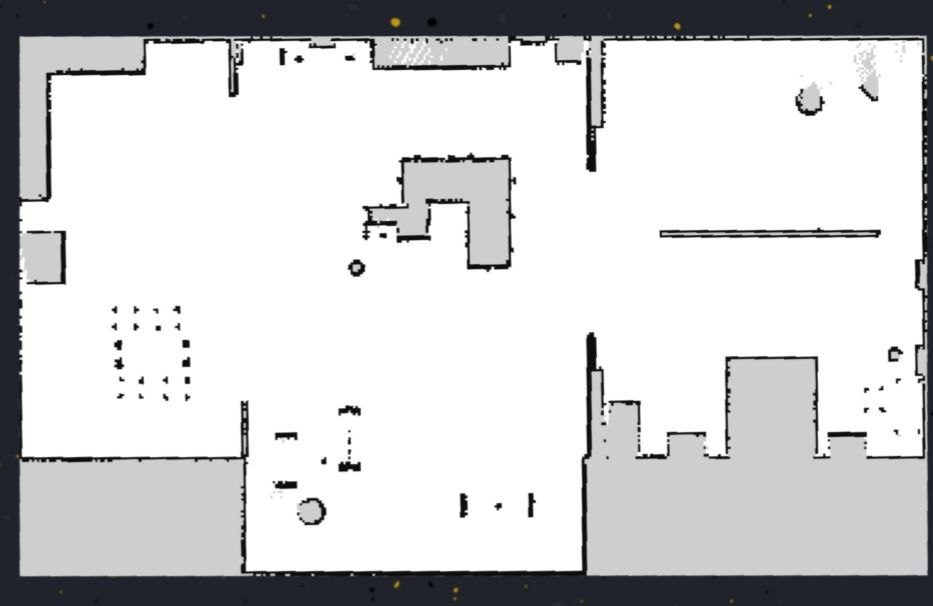

    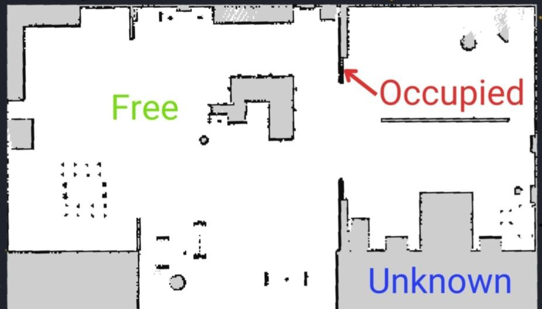

    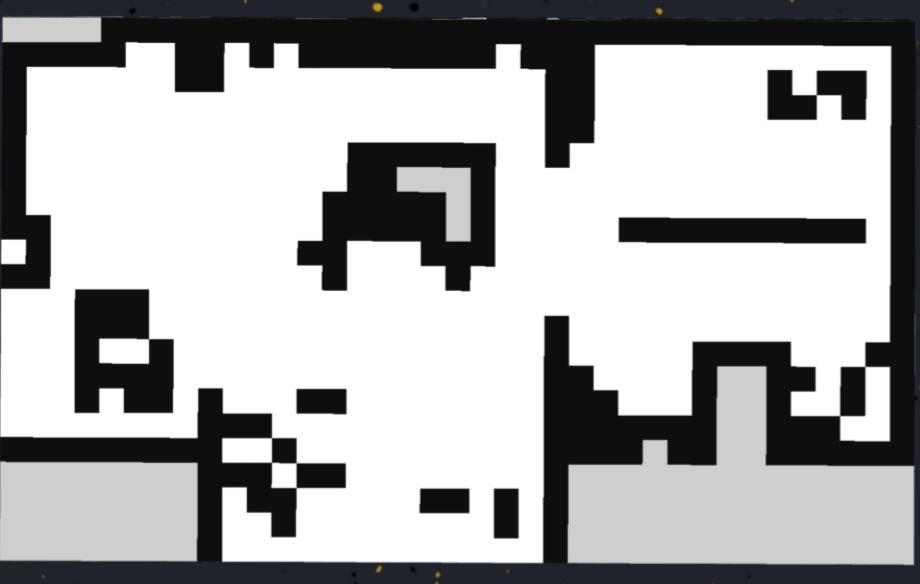

    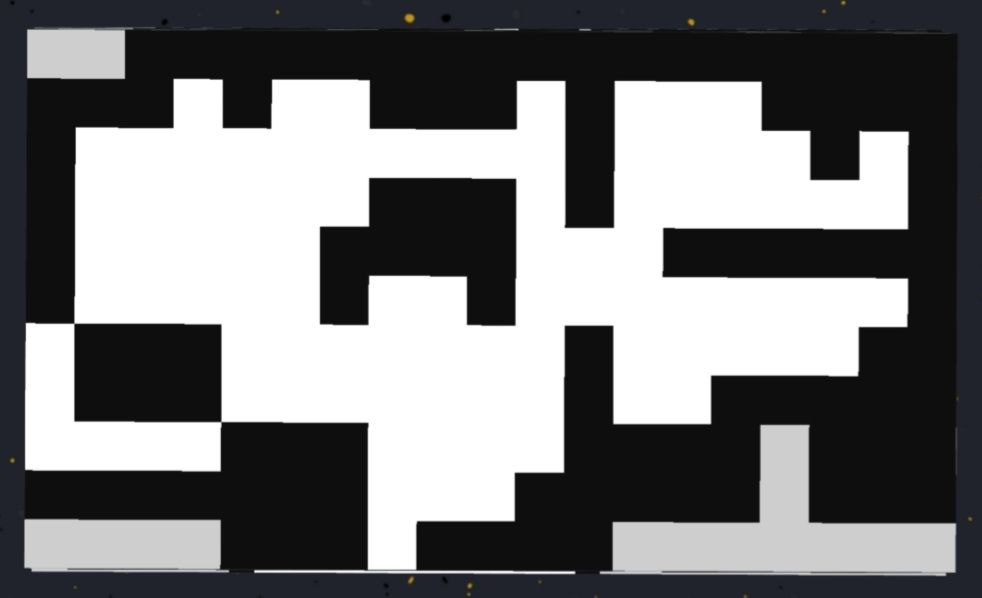

    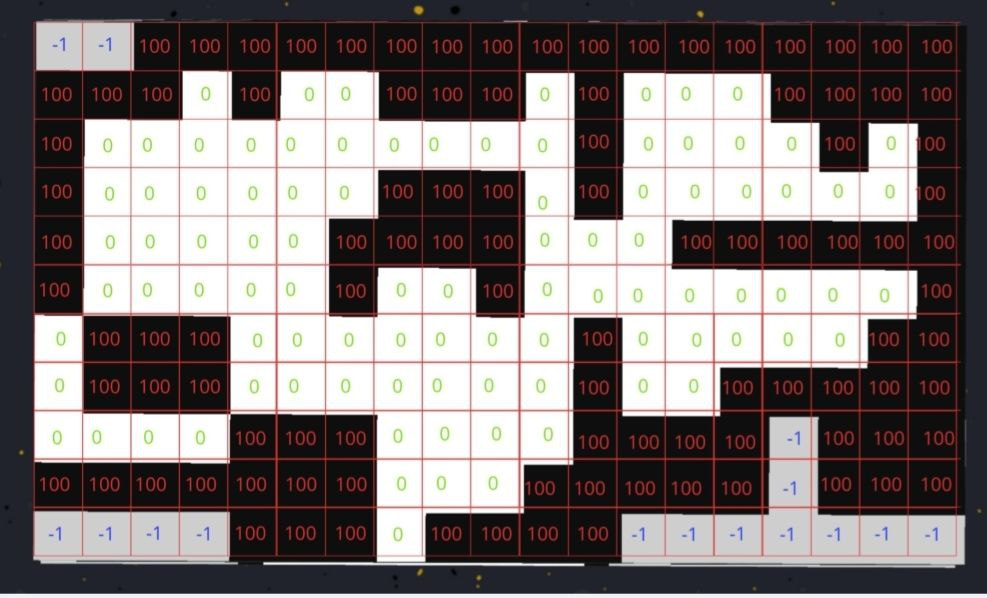

---

# 📌 **Graph Search: Overview**

### 🔹 What is Graph Search?

**Graph search** is the process of **systematically exploring a graph** to find a path or relationship between nodes (vertices). In path planning, it’s used to find the  **shortest** ,  **safest** , or **most efficient** path between a **start node** and a **goal node** in a graph that represents the environment or configuration space.

### 📊 **Graph Structure Recap**

A **graph** consists of:

* **Nodes (vertices)** : Represent locations, configurations, or states.
* **Edges** : Represent valid connections or transitions between nodes.
* **Edge weights (optional)** : Represent cost, distance, time, risk, etc.

### 🔎 **Common Graph Search Algorithms**

1. **Breadth-First Search (BFS)**

* Explores neighbors level by level.
* Guarantees the shortest path in **unweighted** graphs.
* Uses a  **queue** .

**2. Depth-First Search (DFS)**

* Explores as deep as possible along each branch before backtracking.
* Not guaranteed to find the shortest path.
* Uses a **stack** (or recursion).

3. **Dijkstra’s Algorithm**

* Finds the **shortest path** in  **weighted graphs** .
* Expands the lowest cumulative cost node first.
* Guarantees optimality if all weights are non-negative.

**4.  A Search ***

* Like Dijkstra’s, but uses a **heuristic** to prioritize promising paths.
* Cost = `g(n)` (cost so far) + `h(n)` (estimated cost to goal).
* Very efficient and optimal with admissible heuristics.

---

# **What is BFS?**

 **Breadth-First Search** , or  **BFS** , is a classic graph search algorithm used to explore or traverse a graph by examining all the nodes at the current depth (or distance) before moving on to nodes at the next level of depth. It's like exploring a building floor by floor: you finish checking one level before going upstairs to the next.

##### How It Works ?

BFS starts at a **starting node** and looks at all of its immediate neighbors first. Once all direct neighbors have been visited, it then moves on to the neighbors of those neighbors, and so on. It does this using a  **queue** , which helps it remember the order in which to explore nodes. The first node to be discovered is the first one to be explored — just like standing in a line and taking turns.

Because it explores the closest nodes first, BFS is **guaranteed to find the shortest path** (in terms of the number of steps) from the starting point to the goal, but **only if all edges have the same cost** — meaning it's suitable for  **unweighted graphs** .

##### Where BFS is Useful ?

BFS is especially useful in scenarios where you want the shortest path in a space that doesn't involve varying movement cost. Examples include:

* Navigating a  **maze or a grid** , where each move (up, down, left, right) costs the same.
* Finding the **shortest number of steps** to solve a puzzle or reach a goal in a game.
* Exploring **friendship connections** in social networks (e.g., "How many degrees of separation between person A and B?").

##### Limitations

While BFS is simple and effective for certain problems, it has limitations. In environments where moving between nodes has different costs (for example, if moving uphill takes more effort than moving on flat ground), BFS may not give the best path. In those cases, more advanced algorithms like **Dijkstra’s** or **A*** are preferred because they take varying costs into account.

---

# What is DFS?

**Depth-First Search (DFS)** is a graph traversal algorithm that explores as far as possible along each branch before backtracking. Think of it like exploring a cave: you keep walking down one tunnel until you hit a dead end, then you backtrack and try a different path. It goes  **deep before wide** , in contrast to  **Breadth-First Search** , which goes  **wide before deep** .

##### How DFS Works

DFS begins at a  **start node** , and it moves to one of its neighbors — any one, there's no specific order — and keeps following neighbors of neighbors, diving deep into the graph. When it reaches a node with no unvisited neighbors, it **backtracks** to the previous node and continues from there.

This process continues until it either finds the goal or has explored the entire graph. DFS uses a **stack** structure, either explicitly (in code) or implicitly via recursion.

##### Intuition Behind DFS

DFS is like solving a maze by always taking the first hallway you see, going as far as you can, and only turning back when you hit a wall. You don’t try all possible directions at each intersection — you commit to a direction and see how far it gets you.

This can be efficient in some cases, especially when the solution is deep in the graph. However, if the solution is shallow or close to the start, DFS might miss it for a long time.

##### When to Use DFS

DFS is useful when:

* You're searching for  **any solution** , not necessarily the shortest.
* You want to explore  **all possible paths** , such as in puzzle solving or decision trees.
* Memory is limited: DFS uses less memory than BFS in wide graphs.
* You need to  **visit all nodes** , like in cycle detection, topological sorting, or connected components.

##### Limitations of DFS

DFS does **not guarantee the shortest path** in most cases. Because it doesn't explore all neighbors equally, it might find a long, winding route even when a short path is nearby. In graphs with cycles, it can also loop forever unless you keep track of visited nodes.

Another downside is that DFS can get stuck going deep in a huge or infinite graph, potentially wasting time or hitting recursion depth limits.

---

# What is Dijkstra’s Algorithm?

**Dijkstra’s algorithm** is a classic pathfinding method used to find the **shortest path** from a **starting point** to a **target point** — or to all points — in a graph where **edges have costs** (also called weights). It works by always expanding the  **cheapest known path first** , ensuring that the path it eventually finds is the **optimal** one.

It's like trying to find the cheapest route to your destination when every road has a different toll.

##### How It Works (Conceptually)

Imagine standing at your start location and looking at all the paths around you. You walk to the nearest one with the  **lowest cost** , then from there, check the next cheapest option that hasn’t already been taken. As you go, you keep track of how much each path “costs” you.

Each time you discover a new place, you ask:

* “Have I been here before with a cheaper route?”
* If  **no** , you update your map with this new better path.
* If  **yes** , you ignore it — you’ve already found a better way.

This continues until you reach the destination with the  **lowest possible cost** .

##### What Makes Dijkstra’s Algorithm Special?

Unlike simpler methods like BFS, which treat every move as equal, Dijkstra's algorithm takes into account that some paths may be **longer, slower, riskier, or more expensive** than others. It is designed for graphs where  **edges (paths) have different weights** .

Because of this, Dijkstra is widely used in:

* **Navigation systems** (finding shortest or fastest route on maps),
* **Network routing** (finding least-delay paths),
* **Robotics** (path planning on cost maps),
* and many other real-world systems.

##### Key Idea

The most important idea behind Dijkstra's algorithm is this:

> “Always move next to the place that can be reached the cheapest from where you started.”

This greedy approach — always choosing the best immediate option — eventually leads to the  **globally best solution** .

##### Limitations

While Dijkstra’s algorithm is very powerful, it has some limitations:

* It  **does not use a heuristic** , so it may explore many unnecessary paths before reaching the goal.
* In large or complex maps, it can be **slower** than A* search, which adds directional guidance.
* It assumes that  **all edge costs are non-negative** . If some paths have negative costs, it won’t work correctly.
* 

---

# What is a Heuristic?

A **heuristic** is a **smart guess** or **estimate** about how close you are to the goal. In path planning, it tells the algorithm:

> “If you're standing at this point, how far (or how costly) might it be to reach the goal?”

It’s like looking at a map and thinking, *“The goal is about 5 kilometers in a straight line from here”* — even if the actual road may curve.

The heuristic helps the algorithm decide  **which direction to search first** , by preferring the paths that  *look more promising* .

### Examples of Heuristics in Grids:

* **Euclidean distance** : straight-line distance to the goal.
* **Manhattan distance** : grid-like (up/down, left/right) steps to the goal.
* **Diagonal distance** : for movement in 8 directions.

  These are quick to compute and **don't overestimate** — a key property called  *admissibility* .

---

## ⭐ What is A* (A-Star)?

**A*** is an advanced pathfinding algorithm that combines two things:

1. The **real cost** to reach a point from the start (like Dijkstra),
2. The **estimated cost** from that point to the goal (the heuristic).

So instead of blindly searching the cheapest paths (like Dijkstra) or the most promising directions (like Greedy search), A* does **both** — making it faster and smarter.

##### How A* Thinks

Imagine a robot navigating a map:

* It knows how far it has already walked — that’s the **actual cost** (called `g`).
* It also makes a smart guess about how far is left — that’s the **heuristic** (`h`).
* A* adds these two: `f = g + h`.

It always chooses to explore the point with the  **lowest total estimated cost (`f`)** . This helps it:

* Avoid wasteful exploration,
* Stay focused toward the goal,
* And still guarantee the  **shortest path** , if the heuristic is admissible (never overestimates).

##### Why A* is Great

* **Optimal** : Finds the shortest path, like Dijkstra.
* **Efficient** : Uses the heuristic to avoid unnecessary areas.
* **Flexible** : You can tune the heuristic to be more or less aggressive.
* **Widely used** in robotics, games, and mapping.

---

Apart from **graph search algorithms** (like A*, Dijkstra, BFS, etc.), there are several **obstacle avoidance strategies** used in robotics and autonomous systems — especially for **real-time navigation** or  **reactive control** .

These strategies often work **without building an explicit global map** or  **graph** , and instead rely on sensor data, geometry, or physics-based rules to avoid obstacles. Here are the most important ones:

---

# **Obstacle Avoidance strategy (MP)**

## 🛡️ 1. **Potential Fields**

* Think of the robot as a particle in a magnetic field:
  * The **goal** attracts the robot.
  * **Obstacles** repel it.
* The robot moves in the direction of the  **resulting force vector** .

### Pros:

* Smooth and continuous motion
* Easy to implement

### Cons:

* Gets stuck in **local minima** (points where forces cancel out, but not at the goal)

## 🚗 2. **Follow the Gap Method (FTG)**

* Analyzes LIDAR or distance sensor data.
* Finds the **largest open gap** (area between obstacles).
* Steers the robot toward the  **middle of the gap** , with a bias toward the goal direction.

### Pros:

* Very fast and reactive
* Excellent for high-speed navigation

### Cons:

* Doesn’t use memory or global planning
* Can be short-sighted if the goal is behind obstacles

## 🔄 3. **Reactive Behavior-Based Control**

* Uses **simple rules** like:
  * If obstacle on the left → turn right.
  * If front is blocked → stop or reverse.
* Often combined with fuzzy logic or neural networks.

### Pros:

* Very lightweight and fast
* Good for simple environments

### Cons:

* Not reliable for complex or unknown maps
* May oscillate or behave unpredictably

---

# Conclusion

This session provides a comprehensive introduction to **path planning** and  **motion planning** , two critical components in autonomous robotics. We began by defining the planning problem, exploring how an agent understands and navigates its environment, starting from raw physical space to abstract representations like configuration space and discretized grids.

We discussed various  **planning approaches** :

* **Graph-based methods** , including BFS, DFS, Dijkstra, and A*, which help find optimal or feasible paths across structured maps.
* **Map construction techniques** such as visibility graphs, Voronoi diagrams, and cell decomposition, which organize space for easier planning.
* We also emphasized **real-time obstacle avoidance strategies** like Potential Fields, Follow the Gap, and Reactive Behaviors, which support local, dynamic decision-making during execution.

Together, these tools form the foundation for enabling intelligent, efficient, and safe robot navigation — bridging the gap between high-level goal planning and low-level motion execution.
